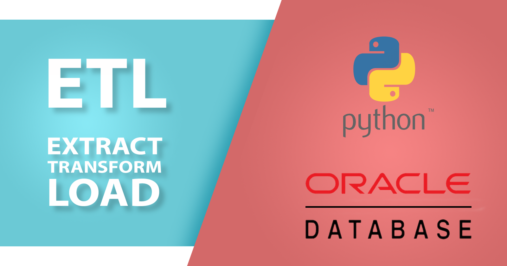

# Proyecto ETL de Oracle Transaccional a Oracle Data Warehouse

## Descripción

Este proyecto es un ETL (Extract, Transform, Load) que migra datos de una base de datos Oracle Transaccional ( Conexion Tradicional ) a una Oracle Datawarehouse ( Conexion por Wallet ).
Se ha desarrollado utilizando Python ( FASTAPI ), Docker y la librería InstantClient de Oracle.

## Características

- ETL: Extrae, transforma y carga datos de Oracle Transaccional a Oracle Datawarehouse.
- Servidor FastAPI: Proporciona una interfaz accesible para las funciones del ETL.
- APScheduler: Programa la ejecución del ETL de forma automática.

## Requisitos

- Python
- Docker
- Oracle InstantClient

## Instalación en Modo Desarrollo

1. Clone el repositorio
    
    ```bash
    git clone https://github.com/luis122448/python-etl-oracle-oracle.git
    ```

2. Ingresar al directorio del proyecto
        
    ```bash
    cd python-etl-oracle-oracle
    ```

3. Configurar la informacion "Distinguished Name" (DN) del certificado SSL
    
    ```bash
        export COUNTRY=PE
        export STATE=LIMA
        export CITY=LIMA
        export ORGANIZATION=''
        export ORGANIZATIONAL_UNIT=''
        export COMMON_NAME=''
        export EMAIL=''
    ```

4. Ejecutar el script de instalación
    
    ```bash
        sudo bash install.sh
    ```

5. Defina las credenciales de la BASE DE DATOS Oracle en el archivo .env
    
    ```bash
        DB_ORACLE_USER_TRANSACCIONAL=''
        DB_ORACLE_PASSWORD_TRANSACCIONAL=''
        DB_ORACLE_DSN_TRANSACCIONAL=''
        DB_ORACLE_USER_DATAWAREHOUSE=''
        DB_ORACLE_PASSWORD_DATAWAREHOUSE=''
        DB_ORACLE_DSN_DATAWAREHOUSE=''
    ```

6. Aidicione los archivos de la wallet de Oracle en el directorio app/wallet
    
    ```bash
        cp ~/sqlnet.ora ./app/wallet
        cp ~/tnsnames.ora ./app/wallet
        cp ~/cwallet.sso ./app/wallet 
    ```

7. Ejecutar el script de inicialización
    
    ```bash
        sudo bash init.sh
    ```

## Despliegue en Producción

Para el despliegue en producción se ha utilizado Docker y Docker Compose, puede revisar el archivo docker-compose.yml para conocer los detalles de la configuración.

1. Ejecutar el script de despliegue
    
    ```bash
        sudo bash deploy.sh
    ```

## Contribución

Si desea contribuir a este proyecto, por favor siga los siguientes pasos:
1. Fork el proyecto
2. Cree una rama para su contribución
3. Realice los cambios
4. Haga un Pull Request
5. Espere a que su Pull Request sea revisado
6. ¡Gracias por su contribución!

## Licencia

Este proyecto está bajo la licencia MIT. Para más información por favor revisar el archivo LICENSE.